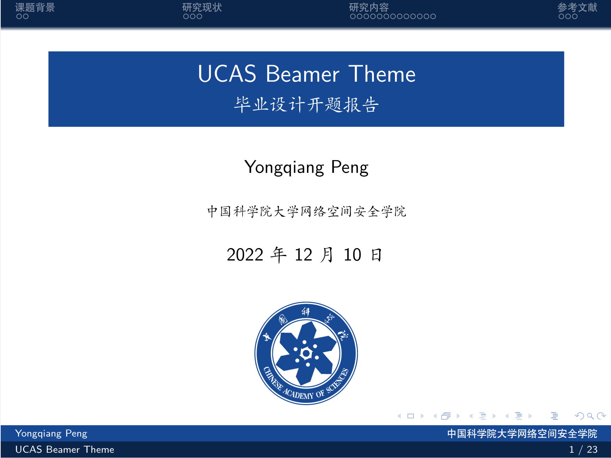
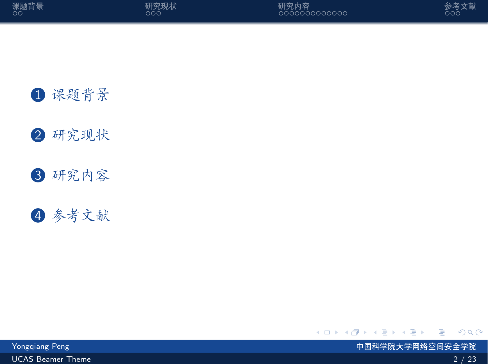
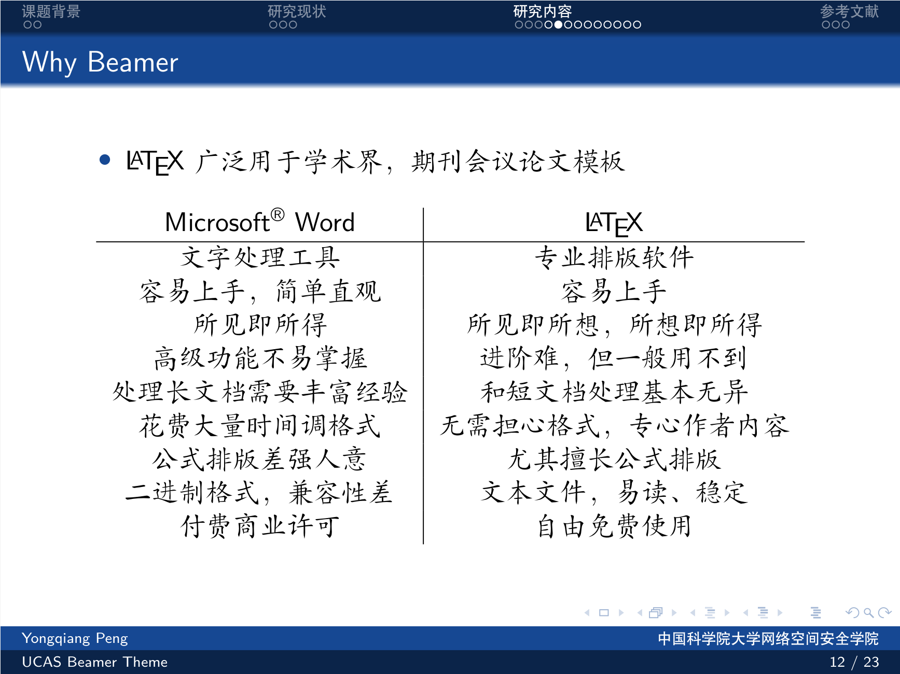
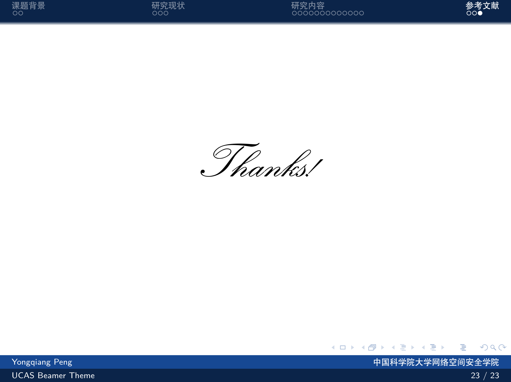

# UCAS-Beamer-Theme

 **A Beamer Theme of UCAS for academic report, thesis and talk.**

## Introduction

- 基于[THU-Beamer-Theme](https://github.com/tuna/THU-Beamer-Theme)进行修改，仅修改配色和校徽，如有更多需求，可自行修改sty文件

- 改完发现已经有学长改过了orz，加上了研究所的logo，[学长模板的Overleaf地址](https://www.overleaf.com/latex/templates/ucas-casia-beamer-theme/stdydfhvkctw)

## Beamer Image

## 讲稿

p4：接下来我将以“快问块答”的形式简单介绍LoongArch。

第一个问题：“什么是LoongArch?”
答：“LoongArch由龙芯公司推出的一种 RISC 风格的指令系统架构”

第二个问题：“LoongArch 的意义？”
答：“打破外国指令集垄断，建立完全自主的信息产业体系”

第三个问题：“LoongArch 的发展情况？”
答：“硬件平台基本完善，基础软件获得开源社区广泛认可”

p5：在硬件平台，基于LoongArch的CPU产品包括面向桌面与服务器的龙芯3号5000系列，以及面向工控与中断的龙芯2K0500和2K1000LA等。

此外，龙芯公司还推出了7A1000与7A2000桥片，与龙芯3号CPU搭配组成完整的硬件系统

p6：此外，LoongArch已经支持了多种主流的基础软件。

BIOS与内核支持PMON，UEFI和Linux

编译器支持GCC，LLVM，Golang

基础库支持glibc

拥有了这些硬件平台和基础软件的支持，LoongArch生态已经达到了一个“能用”的状态

p7：本课题所研究的对象是LoongArch上运行的实时操作系统。

目前的发展情况是龙芯公司针对嵌入式产品提供了闭源的 loongOS

但是还没有开源的 LoongArch RTOS 支持

本课题所做的工作是将开源实时项目 Xenomai 移植到 LoongArch 平台，并建立了实时任务模型进行评估和优化，

最终的产物是提供了基于龙芯 3A5000+7A2000 平台的 Xenomai 开源代码和有利于实时场景配置

p8：接下来背景部分，也就是关于Xenomai项目的介绍

p9：Xenomai项目是一个基于ADEOS的“双内核”系统

ADEOS指“自适应多域复用环境”是一种虚拟化技术，用于提供多个内核同时运行的环境

双内核指的是Xenomai系统中cobalt实时内核和Linux通用内核协同工作，提升实时性

左侧是Xenomai项目的架构图，主要包含了Xenomai项目的3大模块：I-pipe，cobalt和libcobalt

I-pipe是ADEOS的一个具体实现，提供了双内核运行基础

cobalt是专用的实时内核，用于提高系统实时性

libcobalt是Xenomai提供的用户实时库，用于编写实时程序，获取实时内核提供的实时服务

p10：Xenomai项目的优点在于

一，能够提供较好的实时性，官方宣称能够提供硬实时保障

二，带来了较好的兼容性，得益于libcobalt中实现了若干与主流API相兼容的API，官方宣称的效果是只需要对实时程序代码进行很小的改动，就能将一个基于实时框架的实时程序无缝迁移到Xenomai系统中

p11：
